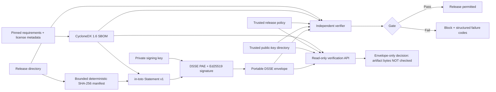

# AttestForge

**Project #02 — Global Talent technical portfolio · Software supply-chain security**  
**Offline-first Ed25519 release attestations, CycloneDX SBOM binding, and fail-closed release policy gates.**

[](https://github.com/sattipraveena3-sudo/attestforge/actions/workflows/ci.yml)


> **Status (9 October 2026):** 100 local tests passed; 90.71% combined statement/branch coverage; positive and tamper-negative CLI smoke passed. GitHub Actions, Docker runtime, third-party security review and external adoption have **not** yet been verified. The badge URL above becomes active only after the repository is published and CI runs. No claims of SLSA certification or production security assurance are made.

## Why this project exists

A release can pass unit tests and still be modified before deployment. A checksum alone does not tell a deployer **who signed a manifest**, whether that signer is trusted, which exact files were signed, whether a dependency inventory was bound, or whether release policy permits the artifact. AttestForge implements a compact offline verification boundary: sign a canonical file inventory as a DSSE-wrapped in-toto Statement, bind a CycloneDX SBOM digest, and independently verify the release bytes against a local trust store and policy.

Unlike Project #01 **VeriRAG** (LLM/RAG evidence reliability), this project is in **software supply-chain cryptography, release engineering and DevSecOps**.

## Features

- **Content integrity:** deterministic SHA-256 manifest of every release file (except top-level `.git`), with symlink/hardlink rejection, bounded hashing and change-during-read checks.
- **Cryptographic attestation:** Ed25519 signatures over the DSSE pre-authentication encoding (PAE) of a canonical in-toto Statement v1.
- **Explicit trust:** verification requires a locally configured set of trusted public PEM keys. An untrusted signature never becomes valid merely because it exists.
- **Dependency binding:** deterministic minimal CycloneDX 1.6 SBOM generated from strictly pinned Python requirements; the signed predicate binds its canonical digest and component count.
- **Fail-closed policy:** allowlisted builder claim, age/future-skew limits, required files, artifact size limits, forbidden extensions, license checks and mandatory SBOM.
- **Two distinct assurance scopes:** the CLI checks **actual artifact bytes**; the read-only HTTP API checks **signature, SBOM and policy only**, and never claims that artifact bytes were verified.
- **Operational packaging:** CLI, FastAPI, non-root read-only Docker runtime, Docker Compose, GitHub Actions matrix CI and tag-triggered release workflow, 100 automated tests, negative controls and documentation.

## Architecture



### Trust boundary

The **private signing key is never included in the release artifact**. The verifier does not fetch remote keys or rely on a caller-provided key. The builder name is a **signed self-asserted claim**, not independently proven CI identity. For high-assurance environments, pair this project with identity-bound key management, transparency logs, isolated builders, and independent policy administration. See [Threat Model](docs/THREAT_MODEL.md).

## Quick start (Python 3.11+)

```bash
git clone https://github.com/sattipraveena3-sudo/attestforge.git
cd attestforge
python -m venv .venv
source .venv/bin/activate  # Windows: .venv\Scripts\activate
python -m pip install -e '.[dev]'
make test
make smoke
```

### Generate, attest, and verify

```bash
mkdir -p .local/trust
attestforge keygen --private .local/release-private.pem --public .local/trust/release-public.pem
attestforge sbom --requirements examples/requirements.lock --licenses examples/licenses.json --app-name example-release --out .local/release.sbom.json
attestforge attest --artifact examples/demo_release --private .local/release-private.pem --builder local-demo --sbom .local/release.sbom.json --out .local/release.dsse.json
attestforge verify --artifact examples/demo_release --envelope .local/release.dsse.json --trust-dir .local/trust --policy examples/policy.json --sbom .local/release.sbom.json
```

Success exits `0`. Tampering, untrusted signatures, missing SBOMs or policy violations exit `2` with machine-readable failure codes.

## Read-only HTTP verification API

```bash
export ATTESTFORGE_TRUST_DIR="$PWD/.local/trust"
export ATTESTFORGE_POLICY_PATH="$PWD/examples/policy.json"
uvicorn attestforge.api:app --host 127.0.0.1 --port 8000
```

Endpoints: `GET /healthz`, `GET /readyz`, and `POST /v1/verify-envelope`. The API checks envelope, SBOM and policy only; run the CLI against actual bytes for a release gate.

## Docker

```bash
cp .local/trust/release-public.pem examples/trust/
docker compose up --build
```

The service runs as non-root UID 10001, with a read-only filesystem, dropped capabilities, no-new-privileges, localhost port binding and read-only trust/policy mounts.

## Quality checks

```bash
python -m compileall -q src
pytest -q --cov=attestforge --cov-branch --cov-report=term-missing
ruff check src tests
bash scripts/smoke.sh
bash scripts/docker_smoke.sh
```

CI runs Python 3.11/3.12/3.13 tests, static lint, coverage threshold >=90%, CLI smoke and Docker smoke. A separate tag-triggered release workflow reruns checks, builds a wheel/sdist and publishes GitHub Release assets.

## Standards alignment and explicit limits

- Uses DSSE PAE and an in-toto Statement v1 with a project-specific predicate. This is **not** a SLSA provenance claim or certification.
- Produces a minimal CycloneDX JSON 1.6 dependency inventory from pinned requirements.
- Ed25519 verifies a signed file manifest, but trust policy and key distribution must be managed independently.
- Local directory hashing is not an atomic filesystem snapshot. Avoid concurrent modifications and sign immutable build outputs.

Built as **Global Talent Portfolio Project #02** by **Praveena Satti**. Distinct from [VeriRAG](https://github.com/sattipraveena3-sudo/veritrag).

See [Validation Report](docs/VALIDATION_REPORT.md), [Repository Metadata](docs/REPO_METADATA.md), [Visibility Plan](evidence/VISIBILITY_PLAN.md), [Visa Evidence Notes](evidence/GLOBAL_TALENT_EVIDENCE.md), and [LinkedIn Launch Post](evidence/LINKEDIN_POST.md).

## Licence

MIT. See [LICENSE](LICENSE). Contributions welcome; see [CONTRIBUTING.md](CONTRIBUTING.md).
