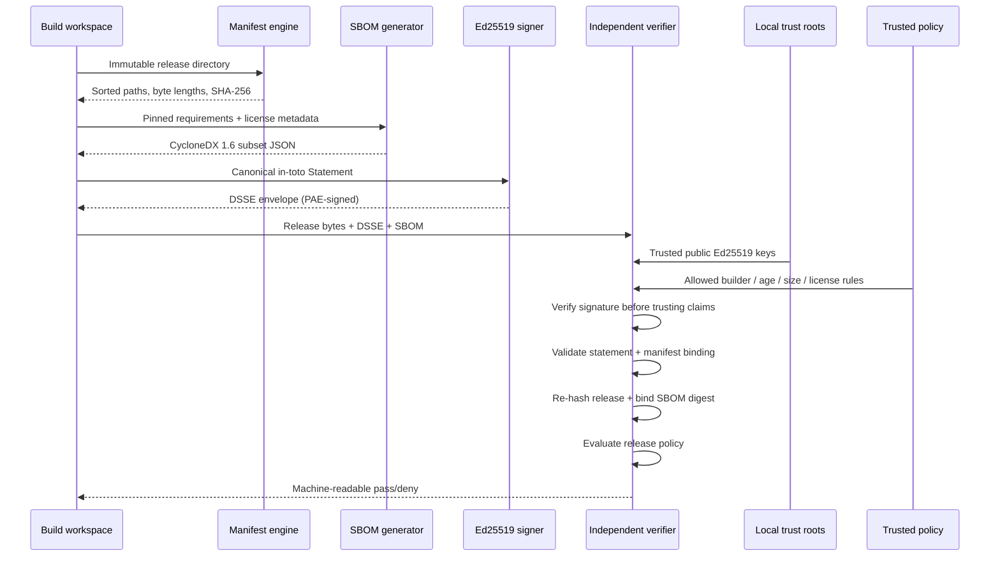

# Architecture and Design Decisions

## Problem and boundary

A release must be evaluated as a **specific set of bytes**, not as a mutable directory name. AttestForge's full-verification CLI computes an inventory of every release file, signs that inventory in an in-toto Statement using a DSSE Ed25519 envelope, and independently verifies that the file bytes, signer, SBOM binding and policy match. The HTTP API intentionally performs only the portable envelope/policy subset and labels its assurance scope explicitly.

## Components and data flow



## Canonical manifest

```json
{
  "version": 1,
  "files": [
    {"path": "README.md", "size": 10, "sha256": "...64 lowercase hex characters..."}
  ],
  "totalBytes": 10
}
```

The manifest is serialized as UTF-8 JSON with sorted keys, no insignificant spaces, non-ASCII preserved, and no non-finite numbers. The in-toto subject digest is `sha256(canonical_json(manifest))`. The signed predicate includes the complete manifest, builder claim, UTC timestamp and optional SBOM binding. The verifier reconstructs the digest from the signed manifest before comparing it with the subject.

## DSSE details

The DSSE envelope has `payloadType=application/vnd.in-toto+json`, a base64-encoded canonical Statement v1 payload and Ed25519 signature(s). Each signature covers `PAE(payloadType, raw_payload)`:

```
DSSEv1 + " " + len(type_bytes) + " " + type_bytes + " " + len(payload_bytes) + " " + payload_bytes
```

The key ID is the lowercase hex SHA-256 of the raw 32-byte public key, used only to select a key from the **pretrusted** local store. The key ID alone never establishes trust. Signatures are checked before parsing and trusting statement contents. The statement uses a custom `https://attestforge.dev/predicate/release/v1` predicate. No SLSA level or Sigstore identity claim is made.

## SBOM integrity

`sbom` takes only strict `package==version` entries, optional independently supplied SPDX license identifiers, and produces a deterministic minimal CycloneDX 1.6 document. The signed predicate binds the canonical SBOM JSON SHA-256 and component count. This avoids whitespace-only digest drift while rejecting semantic changes. A caller cannot replace a signed dependency list without failing verification.

**Important:** A supplied requirements file can omit transitive dependencies. The generated SBOM is only as complete and accurate as the supplied pins and license metadata. A full production inventory should be generated by a trusted build pipeline and schema-validated using the official CycloneDX schema.

## Policy evaluation

Policy is trusted local JSON with strict allowed fields. It can require a builder claim, freshness, required paths, bounded size/file counts, SBOM presence, known licenses, license denial and forbidden file extensions. Unknown policy fields, malformed trust keys, invalid signatures, altered files, missing SBOMs, and mismatched digests fail closed.

## Security-focused choices

- No automatic remote key fetching, no trust-on-first-use, no caller-provided trust roots in API requests.
- Reject symlinked roots, symlinked directories/files, hardlinked files and special files. Hash using bounded chunks and `O_NOFOLLOW` when supported.
- `os.walk` traversal errors fail closed. Hashing checks file identity/size/mtime before and after reading.
- Strict JSON parser rejects duplicate keys and non-finite values; bounded envelope and SBOM inputs.
- `keygen` uses exclusive creation, POSIX private-key mode `0600`, and refuses overwrites.
- API limits request bodies to 1 MiB and exposes no arbitrary path or remote URL input.
- Docker runs as non-root, read-only, with dropped Linux capabilities and read-only trust/policy mounts.

## Verification scopes

| Mode | Signature | SBOM binding | Policy | Actual artifact bytes | `release_verified` |
|---|---|---|---|---|---|
| CLI `verify` | Yes | Yes | Yes | Yes | True only when all pass |
| API `/v1/verify-envelope` | Yes | Yes | Yes | **No** | **Always false** |

The API's `passed` field means only that its limited envelope/policy checks passed. Clients must not equate this with a full release verification.
